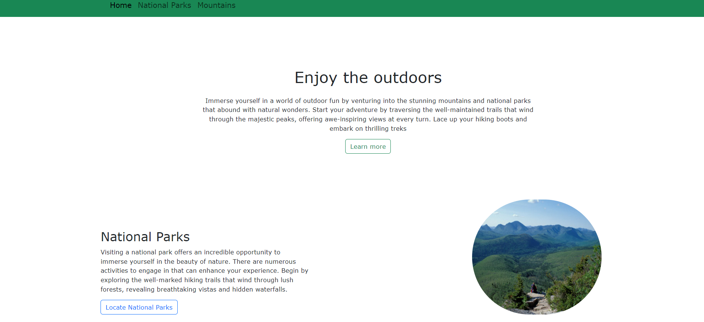
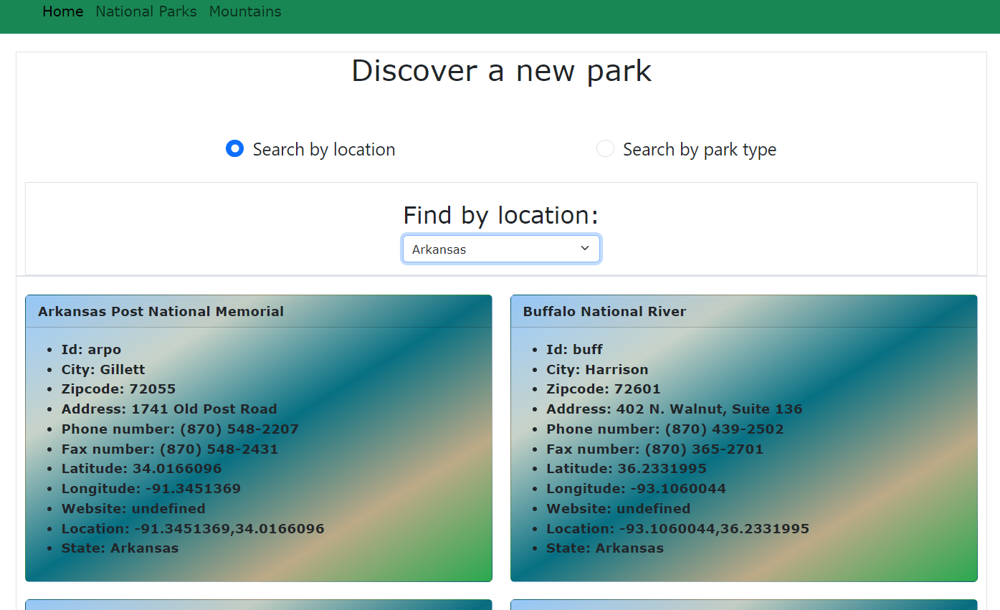
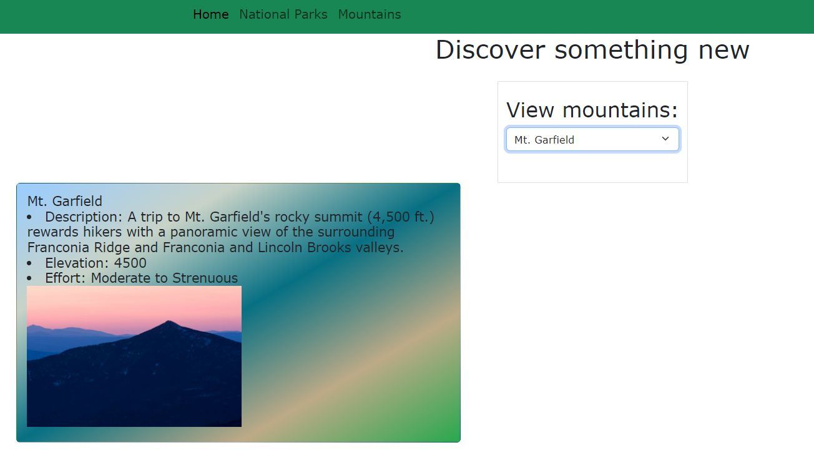

# Capstone-2

A website that helps a user find things to do to enjoy the outdoors

Here is my second capstone "Enjoy the outdoors!

I was tasked to build a website that helps a user find fun activites outdoors, I created 3 pages (Home page, national parks page , and mountains page)

Each page contains navigation links to the othe pages

#National Parks page gave a user 2 options using radio buttons to find a park by LOCATION or PARK TYPE. Location is pre-selected. Once page loads User see 2 radio buttons. Loaction dropdown contains values for states (Array provided), once user select state values bring back are filter results for a user to find park by selectcing a state. upon clicking park types a list of types shown to user in dropdown , user selects a type , window bring back values based on type name. 

#mountains page gave a user one dropdown to select a mountain name , window bring back a 1  mountain with  details and an image based on a user selection.

One piece of interesting code 

I was able to get my radio button border to show , I used different colors 

.form-check-input{
  
    border-right-color: rgb(70, 3, 30);
    border-bottom-color: blue;
    border-left-color: rgb(16, 137, 105);
    border-top-color: purple;
    border-style:dashed;
    border-width: 5px;
    font-size: larger;
    width: 30px;
    height: 30px;
 
}

